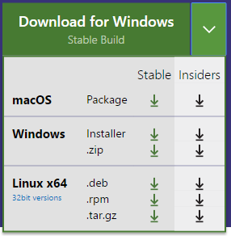
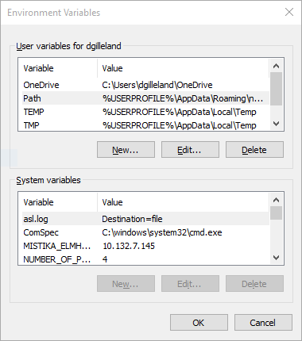

# CSPC-1520 - In-Class Demos

My preferred editor for working with HTML/CSS/JS is **Visual Studio Code**.

## Visual Studio Code et.al.

You can run and/or these samples using [Visual Studio Code (*VSCode*)](http://code.visualstudio.com/) at home or in the school labs. To install the latest version of VSCode in the labs, use the Windows .zip version. Download it to your computer and unzip the file. You can launch VSCode by clicking on the `Code.exe` file.

### Using Visual Studio Code

The easiest/best way to use Visual Studio code is to choose *Open Folder...* from the ***File*** menu and navigate to the folder that holds the code you want to edit (e.g.: the folder holding the index.html you want to work with). Then you will see all the files and sub-folders in the Explorer portion of VSCode and you can double-click those to bring them up in the editor.

## NPM and Node Packages

The labs should already have NodeJS and NPM installed. The following steps will install a user-specific global copy of the latest version of NPM and of [Lite-Server](https://github.com/johnpapa/lite-server).

1. Press `[Windows] + r`, then type `cmd` and press `[Enter]` to open the command prompt.
1. Enter `npm -v` to see the current version (which should be something like 2. something).
1. Enter `npm i -g npm` to install an updated version of NPM under your global user profile.
1. Enter `npm i -g lite-server` to install Lite-Server by John Papa.

The next phase is to update your [user variables](http://lmgtfy.com/?q=windows+user+variables) so that the `PATH` points to the install location of the global NPM packages.

1. Press the `[Windows]` key and type `variables` and click on the result that says "*Edit environment variables for your account*".
1. Click either the **New...** or **Edit...** button to either add or edit the `PATH` variable for the user. 
1. Enter `Path` for the variable name and `%USERPROFILE%\AppData\Roaming\npm;` for the variable value and press the **OK** button.
1. Keep clicking **OK** until the Environment Variables dialog is closed.

At this stage, you may need to restart VSCode.

Inside of VSCode, you can press `[CTRL] + ~` to  toggle the terminal window. To run Lite-Server, you can type `lite-server` inside the terminal window. To exit Lite-Server, press `[CTRL] + c`.

